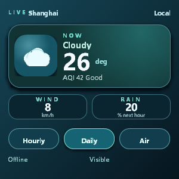
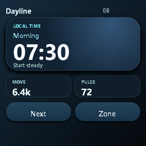
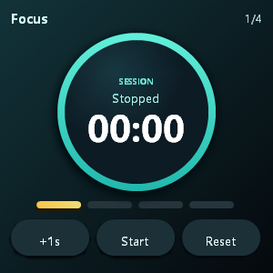
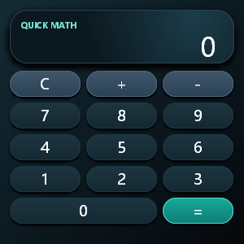

# JellyFrame

> Last updated: 2026-08-09; Applies to: 0.6.0-dev; compatibility baseline: 0.5.0

[](https://github.com/xiaopaoya/JellyFrame/actions/workflows/ci.yml)

JellyFrame is a compact C++ HTML/CSS/JS UI runtime for low-power wearable and
embedded devices. It keeps the parts of a browser pipeline that are useful for
local app UI, then cuts browser features that are too costly or unpredictable
for small targets.

It is not a general-purpose web browser. It is a browser-shaped embedded app
engine: HTML builds structure, CSS describes presentation, platform-neutral C++
code owns layout/rendering, and an optional JerryScript bridge adds bounded
interaction.

The project was developed under the early codename `WearWeb`; current code,
targets and documentation use `JellyFrame`.

> **Pre-1.0 API stability:** JellyFrame has not reached its first stable
> release yet. App authors should rely only on the documented Web-compatible
> subset and documented manifest/tool/host interfaces. Undocumented private
> HTML/CSS/JS shortcuts are not part of the app contract and may change before
> 1.0.

## Highlights

- Platform-neutral C++ core with no file-system, network or windowing
  dependency.
- Tolerant HTML tokenizer/tree builder and compact mutable DOM.
- CSS parser, cascade and style resolver for a documented embedded subset.
- Block/inline layout, simplified flex and bounded responsive Grid, including
  explicit row tracks, numeric placement and direct-child flex ordering.
- Modern small-screen presentation primitives: LTR logical sizing, bounded
  gradients, percentage radii, light shadows, typography/overflow controls,
  package-local image backgrounds and safe CSS nesting.
- Hit testing, DOM-style event dispatch and hardware-neutral input handling.
- Optional JerryScript bindings for local classic scripts, DOM mutation, events,
  form state and host-pumped timers.
- Layer tree, display list, CPU rasterizer/compositor and framebuffer adapters
  for RGBA/BGRA, RGB565/BGR565, RGB332, Gray8 and monochrome output.
- Desktop inspection tools, pseudo browser, Win32 validation shell, pipeline
  diagnostics, app packer, font-resource checker, font-pack generator and a
  thin VS Code helper.

For the exact supported/degraded/deferred feature set, read
[docs/developer_capability_matrix.md](docs/developer_capability_matrix.md).
If you are writing an app rather than porting the engine, start with
[docs/app_author_guide.md](docs/app_author_guide.md).

## App Gallery

These 300x300 screenshots are rendered through the Win32 capture shell from
brand-neutral source packages in `tools/templates/apps`. They are intentionally
JellyFrame-specific wearable UI examples, not replicas of any commercial watch
interface.

**Render pipeline:** JellyFrame Render Core `0.6.0-dev`; Win32 capture shell;
viewport `300x300`; generated `2026-08-09`; source revision `9ca8b61`.

| Weather | Clock |
| --- | --- |
|  |  |

| Focus Timer | Quick Math |
| --- | --- |
|  |  |

## Typical Uses

- Watch-style local apps written with a small HTML/CSS/JS subset.
- Embedded dashboards that need maintainable UI without a full browser.
- Firmware-friendly resource bundles generated from web-like source packages.
- Desktop validation for board ports, text backends, input and rendering.

JellyFrame is not suitable for arbitrary modern websites, full frontend
frameworks, browser storage, network-loaded pages, full Canvas/SVG/video,
complete web compatibility or pixel-perfect rendering. A bounded optional
Canvas 2D V0.4 exists for custom charts, rings, labels, gradients, canvas-to-
canvas drawing and short retained paths, but it is still an opt-in subset rather
than browser-compatible Canvas.

## Quick Start

```powershell
cmake -S . -B build
cmake --build build --config Release
ctest --test-dir build -C Release --output-on-failure
```

Release test binaries explicitly keep `assert(...)` enabled, so this command is
intended to catch correctness failures rather than only process crashes.
CI also runs a separate Debug CTest pass.

After cloning the repository for the first time, run the trial-oriented sample
self-check. It validates every complete app package and reports responsive/font
diagnostics across common wearable targets. The command leaves detailed JSON
reports in `build/doctor_reports` and prints a compact per-sample summary at
the end:

```powershell
python tools\jellyframe_cli.py doctor --build-dir build\Release
```

For a focused external-trial pass, run `doctor --trial`. It strictly checks four
packages: a wearable home screen, settings/scroll interaction, host-backed
status and optional Canvas graphics. Use `--sample NAME` for one package or
`--exclude-sample NAME` when you are iterating on one heavier sample suite.

Render a static page to an image:

```powershell
.\build\Release\jellyframe_pseudo_browser.exe `
  src\render_core\samples\pages\modern\article_cards.html `
  src\render_core\samples\pages\modern\article_cards.css `
  article_cards.bmp 390 640
```

Open an interactive Windows validation shell:

```powershell
.\build\Release\jellyframe_desktop_shell.exe `
  --app tools\templates\apps\calculator
```

For IDE-friendly debugging, use `python tools\debug\jellyframe_debug.py`; it
discovers the desktop build and supports package launch, frame scripts and
captures. The historical `jellyframe_win32_browser.exe` name remains a
compatibility copy for existing scripts.

Create an app package and run package validation plus pipeline diagnostics:

```powershell
python tools\jellyframe_cli.py new `
  --template calculator `
  --output build\my_calculator `
  --id org.example.calculator `
  --name Calculator `
  --target round-300

python tools\jellyframe_cli.py check `
  --root build\my_calculator `
  --target round-300 `
  --report build\my_calculator_report.json `
  --font-budget 16x16
```

Use the same `package` command to produce a third-party installable `.jfapp`:

```powershell
python tools\jellyframe_cli.py package `
  --root build\my_calculator `
  --target round-300 `
  --output-bundle build\my_calculator.jfapp `
  --report build\my_calculator_report.json
```

Before release, explicitly run a multi-device profile check to see whether the
same package remains usable on common watch viewports:

```powershell
python tools\jellyframe_cli.py check `
  --root build\my_calculator `
  --target round-300 `
  --targets round-300,rect-320x240 `
  --report build\my_calculator_responsive_report.json
```

For a full first-time walkthrough, read [HOW_TO_START.md](HOW_TO_START.md).

## Optional Scripting Build

Scripting is optional. `jellyframe_render_core` builds without JerryScript
unless `JELLYFRAME_BUILD_SCRIPTING=ON` is requested.

```powershell
git clone --depth 1 https://github.com/jerryscript-project/jerryscript.git third_party\jerryscript
python third_party\jerryscript\tools\build.py --clean --cmake-param=-DJERRY_VM_HALT=ON

$jerryRoot = Join-Path (Get-Location) "third_party\jerryscript"
cmake -S . -B build-script `
  -DJELLYFRAME_BUILD_SCRIPTING=ON `
  -DJERRYSCRIPT_ROOT="$jerryRoot"
cmake --build build-script --config Release
```

When `JERRYSCRIPT_ROOT` points to a normal JerryScript build tree, CMake finds
the `jerry-core`, `jerry-ext` and `jerry-port` libraries automatically. Supply
`JERRYSCRIPT_LIBRARIES` only for a nonstandard install layout.

The scripting shell supports classic inline/local scripts, small DOM mutation
APIs, event listeners, form properties, host-pumped timers, host-optional XHR V0
and tiny `localStorage` V0. ES modules, remote page loading, full browser
storage and full browser loading algorithms are outside the embedded core.
`JERRY_VM_HALT=ON` is recommended so JellyFrame can interrupt runaway scripts
with the runtime execution budget.

## Repository Map

- `src/render_core`: platform-neutral HTML/CSS/DOM/rendering core.
- `src/app_runtime`: app lifecycle and optional host-service helpers.
- `src/script`: optional JerryScript binding layer.
- `samples`: app packages and app lifecycle samples.
- `tests`: platform-neutral regression tests.
- `benchmarks`: desktop microbenchmarks.
- `ports`: port-support code, board-oriented demos and virtual board tools.
- `tools/templates`: app package starter templates copied by developer tools.
- `tools/presets`: target presets used by packaging tools.
- `tools/schemas`: JSON Schema files for editor/CI validation.
- `tools`: desktop packaging, native inspection and editor helper tools.
- `docs`: technical contracts, supported subsets and host APIs.

## Documentation

- [HOW_TO_START.md](HOW_TO_START.md): first-time build, run and tool guide.
- [docs/README.md](docs/README.md): technical documentation index.
- [docs/developer_capability_matrix.md](docs/developer_capability_matrix.md):
  supported, degraded, lazy and deferred features.
- [docs/engine_architecture.md](docs/engine_architecture.md): pipeline overview.
- [src/app_runtime/docs/app_packaging.md](src/app_runtime/docs/app_packaging.md): app package format and tools.
- [docs/embedded_hal_api.md](docs/embedded_hal_api.md): host/HAL contract for
  board ports.
- [docs/versioning.md](docs/versioning.md): versioning and release discipline.

Chinese documentation uses the `_zh` suffix, for example
[README_zh.md](README_zh.md), [HOW_TO_START_zh.md](HOW_TO_START_zh.md) and
[docs/README_zh.md](docs/README_zh.md).

## Versioning

- Current development version: `0.6.0-dev` in [VERSION](VERSION). The
  documented package compatibility baseline remains `0.5.0` until a later
  breaking release changes it.
- Changelog: [CHANGELOG.md](CHANGELOG.md) and
  [CHANGELOG_zh.md](CHANGELOG_zh.md).
- Version rules: [docs/versioning.md](docs/versioning.md).

## License

JellyFrame is source-available under the
[PolyForm Noncommercial License 1.0.0](LICENSE).

Personal, educational, research, hobby and other noncommercial uses are allowed.
Commercial use requires a separate commercial license from the author; see
[COMMERCIAL.md](COMMERCIAL.md).

This is not an OSI-approved open-source license. The project is intentionally
published as noncommercial source-available software.
