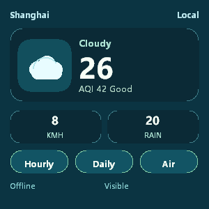
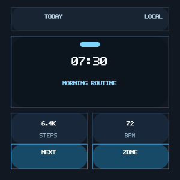
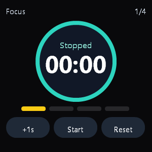
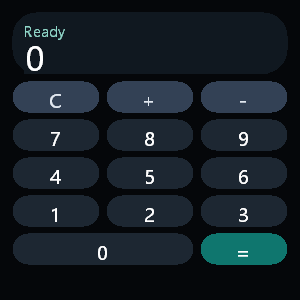

# JellyFrame

[](https://github.com/xiaopaoya/JellyFrame/actions/workflows/ci.yml)

JellyFrame 是一个面向低功耗可穿戴和嵌入式设备的紧凑 C++ HTML/CSS/JS UI
运行时。它保留本地 app UI 真正有价值的浏览器管线部分，同时裁掉对小目标设备过重、
过复杂或不可预测的浏览器能力。

它不是通用浏览器，而是一个“浏览器形状”的嵌入式 app 引擎：HTML 构建结构，
CSS 描述表现，平台无关 C++ 代码负责布局和渲染，可选 JerryScript 桥接提供有界交互。

项目早期代号是 `WearWeb`；当前代码、target 和文档均使用 `JellyFrame`。

> **1.0 前 API 稳定性：** JellyFrame 尚未到达第一个稳定版。App 作者应只依赖文档化的
> Web 兼容子集，以及文档化的 manifest、工具和宿主接口。未文档化的私有 HTML/CSS/JS
> 捷径不属于 app 契约，可能在 1.0 前变化。

## 亮点

- 平台无关 C++ 核心，不依赖文件系统、网络或窗口系统。
- 容错 HTML tokenizer/tree builder 和紧凑可变 DOM。
- 面向嵌入式子集的 CSS parser、cascade 和 style resolver。
- Block/inline layout、简化 flex、响应式 grid-card layout、有界 positioning 和表单控件。
- 命中测试、类 DOM 事件派发和硬件无关输入处理。
- 可选 JerryScript binding，支持本地 classic scripts、DOM mutation、events、form state
  和宿主泵动 timers。
- Layer tree、display list、CPU rasterizer/compositor，以及 RGBA/BGRA、RGB565/BGR565、
  RGB332、Gray8、单色输出的 framebuffer adapter。
- 桌面检查工具、伪浏览器、Win32 验证壳、管线 diagnostics、app packer、字体资源检查、
  字体包生成器和薄 VS Code helper。

精确的支持/降级/延后功能见
[docs/developer_capability_matrix_zh.md](docs/developer_capability_matrix_zh.md)。

## 应用截图

下面这些 300x300 截图通过 Win32 capture shell 从 `tools/templates/apps`
中的品牌中性 source package 实际渲染生成。它们是 JellyFrame 自己的可穿戴 UI
示例，不是一比一复刻任何商业手表界面。

| Weather | Dayline |
| --- | --- |
|  |  |

| Focus Timer | Quick Math |
| --- | --- |
|  |  |

## 典型用途

- 使用小型 HTML/CSS/JS 子集编写手表类本地 app。
- 需要可维护 UI、但不能承担完整浏览器成本的嵌入式 dashboard。
- 从 web-like 源包生成适合固件集成的资源表。
- 在桌面验证开发板 port、文本后端、输入和渲染。

JellyFrame 不适合直接运行任意现代网站、完整前端框架、浏览器存储、网络加载页面、
Canvas/SVG/video、完整 Web 兼容或像素级一致渲染。

## 快速开始

```powershell
cmake -S . -B build
cmake --build build --config Release
ctest --test-dir build -C Release --output-on-failure
```

把静态页面渲染成图片：

```powershell
.\build\Release\jellyframe_pseudo_browser.exe `
  src\render_core\samples\pages\modern\article_cards.html `
  src\render_core\samples\pages\modern\article_cards.css `
  article_cards.bmp 390 640
```

打开 Windows 交互验证壳：

```powershell
.\build\Release\jellyframe_win32_browser.exe `
  --app tools\templates\apps\calculator
```

创建 app package，并运行 package validation 与管线 diagnostics：

```powershell
python tools\jellyframe_cli.py new `
  --template calculator `
  --output build\my_calculator `
  --id org.example.calculator `
  --name Calculator `
  --target round-300

python tools\jellyframe_cli.py check `
  --root build\my_calculator `
  --target round-300 `
  --report build\my_calculator_report.json `
  --font-budget 16x16
```

需要生成第三方安装包时，同一个 `package` 命令可以输出 `.jfapp`：

```powershell
python tools\jellyframe_cli.py package `
  --root build\my_calculator `
  --target round-300 `
  --output-bundle build\my_calculator.jfapp `
  --report build\my_calculator_report.json
```

发布前可以显式跑多设备 profile 检查，确认同一个 package 在多个常见手表视口上是否仍然可用：

```powershell
python tools\jellyframe_cli.py check `
  --root build\my_calculator `
  --target round-300 `
  --targets round-300,rect-320x240 `
  --report build\my_calculator_responsive_report.json
```

第一次接触项目时，建议继续阅读 [HOW_TO_START_zh.md](HOW_TO_START_zh.md)。

## 可选脚本构建

脚本能力是可选的。除非显式设置 `JELLYFRAME_BUILD_SCRIPTING=ON`，否则
`jellyframe_render_core` 不依赖 JerryScript。

```powershell
git clone --depth 1 https://github.com/jerryscript-project/jerryscript.git third_party\jerryscript
python third_party\jerryscript\tools\build.py --clean --cmake-param=-DJERRY_VM_HALT=ON

$jerryRoot = Join-Path (Get-Location) "third_party\jerryscript"
cmake -S . -B build-script `
  -DJELLYFRAME_BUILD_SCRIPTING=ON `
  -DJERRYSCRIPT_ROOT="$jerryRoot" `
  -DJERRYSCRIPT_LIBRARIES="$jerryRoot\build\lib\MinSizeRel\jerry-core.lib;$jerryRoot\build\lib\MinSizeRel\jerry-port.lib"
cmake --build build-script --config Release
```

脚本壳支持 classic inline/local scripts、小型 DOM mutation API、event listeners、
表单属性、宿主泵动 timers、宿主可选 XHR V0 和极小 `localStorage` V0。ES modules、远程页面加载、
完整浏览器存储和完整浏览器加载算法不属于嵌入式核心。
建议打开 `JERRY_VM_HALT=ON` 构建 JerryScript，这样 JellyFrame 可以用 runtime 执行预算中断失控脚本。

## 仓库结构

- `src/render_core`：平台无关 HTML/CSS/DOM/rendering 核心。
- `src/app_runtime`：app 生命周期与可选 host-service helper。
- `src/script`：可选 JerryScript 绑定层。
- `samples`：app packages 和 app 生命周期样例。
- `tests`：平台无关回归测试。
- `benchmarks`：桌面微基准。
- `ports`：移植支撑代码、面向开发板的演示和 virtual board 工具。
- `tools/templates`：供开发工具复制的 app package 起始模板。
- `tools/presets`：packaging tools 使用的 target presets。
- `tools/schemas`：用于编辑器/CI 校验的 JSON Schema。
- `tools`：桌面 packaging、原生检查工具和编辑器辅助工具。
- `docs`：技术契约、支持子集和宿主 API。

## 文档入口

- [HOW_TO_START_zh.md](HOW_TO_START_zh.md)：首次构建、运行和工具说明。
- [docs/README_zh.md](docs/README_zh.md)：技术文档索引。
- [docs/developer_capability_matrix_zh.md](docs/developer_capability_matrix_zh.md)：
  支持、降级、懒处理和延后功能。
- [docs/engine_architecture_zh.md](docs/engine_architecture_zh.md)：管线总览。
- [src/app_runtime/docs/app_packaging_zh.md](src/app_runtime/docs/app_packaging_zh.md)：app package 格式和工具链。
- [docs/embedded_hal_api_zh.md](docs/embedded_hal_api_zh.md)：开发板 port 的宿主/HAL 契约。
- [docs/versioning_zh.md](docs/versioning_zh.md)：版本和发布纪律。

英文文档使用原文件名；中文文档使用 `_zh` 后缀。

## 版本

- 当前版本：`0.5.0-dev`，见 [VERSION](VERSION)。
- 变更记录：[CHANGELOG.md](CHANGELOG.md) 和 [CHANGELOG_zh.md](CHANGELOG_zh.md)。
- 版本规则：[docs/versioning_zh.md](docs/versioning_zh.md)。

## 许可证

JellyFrame 以 [PolyForm Noncommercial License 1.0.0](LICENSE) 形式提供源码。

个人、教育、研究、爱好和其他非商业用途可以使用。商业使用需要另行取得作者的
商业授权；见 [COMMERCIAL.md](COMMERCIAL.md)。

这不是 OSI 批准的传统开源许可证。本项目有意以“非商业源码可用”
（noncommercial source-available）的方式发布。
