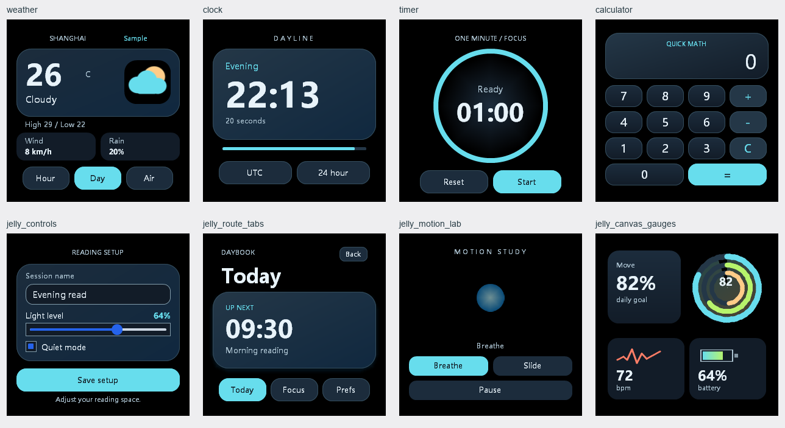

# 示例与模板：视觉和用途

> 最后更新：2026-09-10；适用版本：0.6.0-dev；Render Core 基线：0.6.2

本次采用 [wearable palette](assets/brand/PALETTE_zh.md) 的深底、青蓝主色，恢复天气主卡、时钟大号读数、计时圆环和计算器键帽的层次。Motion Lab 使用青蓝光球，演示缩放、透明度与位移。常规页面外边距约 16–22px，172px 窄屏约 10px；标题和关键反馈按布局单独安排。



## 推荐入口

| 用途 | 示例 |
| --- | --- |
| 响应式天气、包内 BMP、宿主数据与 KV 降级 | `samples/apps/packages/watch_weather` |
| 原生输入框、滑块、复选框与会话反馈 | `samples/apps/packages/jelly_controls` |
| rAF、paint-safe transform、opacity 与暂停 | `samples/apps/packages/jelly_motion_lab` |
| app 内 hash route、active 状态与返回 | `samples/apps/packages/jelly_route_tabs` |
| 本地数据起点 | `tools/templates/apps/weather` |
| 宿主时间、时区与 12/24 小时制 | `tools/templates/apps/clock` |
| 有完成状态的倒计时 | `tools/templates/apps/timer` |
| 有界整数加减、grid 与事件委托 | `tools/templates/apps/calculator` |
| 可选 Canvas 仪表绘图 | `samples/apps/packages/jelly_canvas_gauges` |
| 打包期静态模块合成 | `samples/apps/packages/jelly_static_modules` |

`blank` 保持最小起点。`jelly_wearable_launcher` 没有启动行为，`jelly_watch_face` 含固定日期，`jelly_canvas_smoke` 的放大趋势图主要用于验证 drawImage/路径：三者保留回归用途，退出推荐展示。字体、音频、系统壳和服务包继续承担各自宿主能力验收。

补充验收输入中原有浅色页面、Core/Script 散页、板端资源、scroll 负载和已有 `.jfcapture` 时序不参与本轮美术调整。新增 `capture_review.jfcapture` 单独演示新页面的交互。

## 验证与复现

依据 [作者能力表](app_author_capability_table_zh.md) 与 [开发者能力表](developer_capability_matrix_zh.md)，使用 scripting-enabled Win32 shell 输出实际 BMP，CLI 和 pseudo browser 输出包/布局/资源诊断。图库和本页 PNG 均来自原生图片，不使用浏览器渲染 app。

```powershell
python tests/tool_regression/app_showcase_capture_tests.py build/desktop-scripting-release/Release out/showcase-review
python tests/tool_regression/template_trial_tests.py build/desktop-scripting-release/Release
python tests/tool_regression/package_image_fixture_tests.py build/desktop-scripting-release/Release/jellyframe_desktop_shell.exe build/desktop-scripting-release/Release
```

交互检查覆盖 9 个 app、3 种尺寸，共 27 组、618 对普通/全量重绘帧，默认视口执行 DOM 状态断言，三尺寸检查动画暂停后像素不变。静态模块先打包 `.jfapp` 再捕获。测试只依赖 Python 标准库和已有原生构建，输出独立日志与 `results.json`。

目检阶段另检查 21 个完整包及所有声明目标、22 个补充页、系统壳静态路由、registry 安装入口和 app-font 后端；验证计时到零、重新开始与复位。字体缺字、音频目标不支持及板端故意损坏资源的预期诊断保留。

原生控件使用实现提供的颜色，未用不支持的 `accent-color` 模拟。截图验证桌面渲染，不代表真实圆屏裁切、面板、MCU 帧率、网络天气或音频听感。
