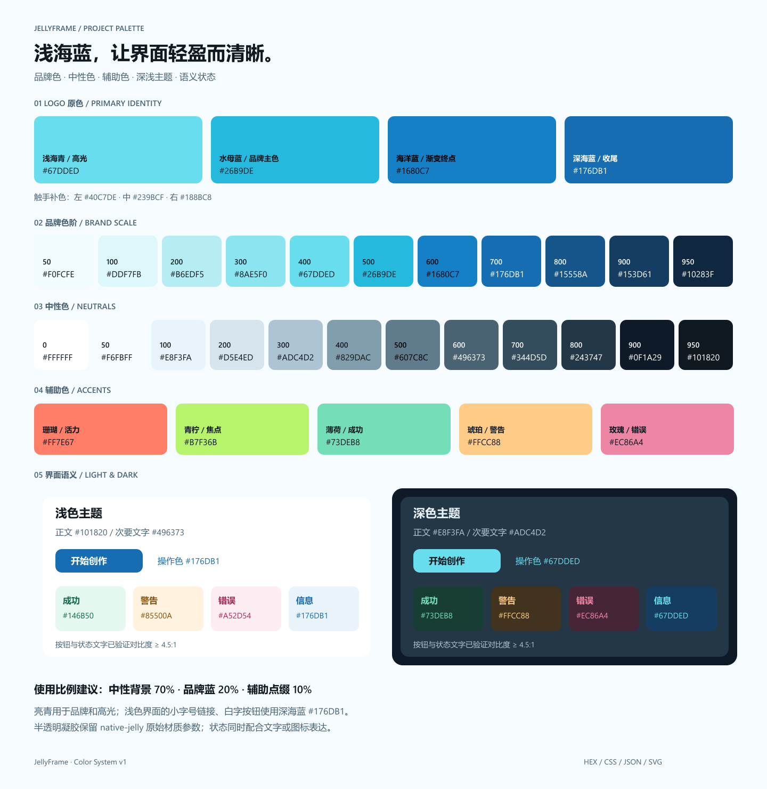

# JellyFrame 项目色卡

> 最后更新：2026-09-08；色卡版本：1；适用版本：0.6.0-dev



本色卡从实际 Logo 配色扩展，沿用 `native-jelly` 的浅海蓝、珊瑚、青柠与凝胶材质。新增色阶和语义映射供后续界面使用；当前应用模板的配色不会因添加色卡自动改变。

## Logo 的实际用色

| 角色 | HEX |
| --- | --- |
| highlight | `#67DDED` |
| primary | `#26B9DE` |
| ocean | `#1680C7` |
| depth | `#176DB1` |
| tentacleLeft | `#40C7DE` |
| tentacleCenter | `#239BCF` |
| tentacleRight | `#188BC8` |

伞盖渐变：`#67DDED`（0%）→ `#26B9DE`（48%）→ `#1680C7`（100%）；中间触手渐变：`#239BCF` → `#176DB1`。方向以 Logo SVG 的渐变坐标为准。

## 基础色板

| 类别 | 色号 / 色阶 |
| --- | --- |
| brand | 50 `#F0FCFE` · 100 `#DDF7FB` · 200 `#B6EDF5` · 300 `#8AE5F0` · 400 `#67DDED` · 500 `#26B9DE` · 600 `#1680C7` · 700 `#176DB1` · 800 `#15558A` · 900 `#153D61` · 950 `#10283F` |
| neutral | 0 `#FFFFFF` · 50 `#F6FBFF` · 100 `#E8F3FA` · 200 `#D5E4ED` · 300 `#ADC4D2` · 400 `#829DAC` · 500 `#607C8C` · 600 `#496373` · 700 `#344D5D` · 800 `#243747` · 900 `#0F1A29` · 950 `#101820` |
| accent | coral `#FF7E67` · lime `#B7F36B` · mint `#73DEB8` · amber `#FFCC88` · rose `#EC86A4` |

品牌 500 是视觉主色；品牌 700 是浅色界面的主要操作色。中性色 900 和 950 分别保留原主题深底与原字标墨色。辅助色中的 mint、amber、rose 是原有半透明状态色的 RGB 基色。

## 深浅主题语义

| Token | 浅色 | 深色 |
| --- | --- | --- |
| `background` | `#F6FBFF` | `#0F1A29` |
| `surface` | `#FFFFFF` | `#243747` |
| `surfaceRaised` | `#E8F3FA` | `#344D5D` |
| `text` | `#101820` | `#E8F3FA` |
| `textMuted` | `#496373` | `#ADC4D2` |
| `border` | `#D5E4ED` | `#344D5D` |
| `controlBorder` | `#607C8C` | `#829DAC` |
| `primary` | `#176DB1` | `#67DDED` |
| `primaryHover` | `#15558A` | `#8AE5F0` |
| `onPrimary` | `#FFFFFF` | `#101820` |
| `link` | `#176DB1` | `#67DDED` |
| `focus` | `#176DB1` | `#67DDED` |
| `selection` | `#DDF7FB` | `#15558A` |
| `onSelection` | `#153D61` | `#E8F3FA` |
| `success` | `#146B50` | `#73DEB8` |
| `successSurface` | `#E5F8F0` | `#173D35` |
| `warning` | `#85500A` | `#FFCC88` |
| `warningSurface` | `#FFF3DF` | `#42331F` |
| `danger` | `#A52D54` | `#EC86A4` |
| `dangerSurface` | `#FDECF1` | `#452536` |
| `info` | `#176DB1` | `#67DDED` |
| `infoSurface` | `#E8F3FA` | `#153D61` |

## 凝胶材质

以下数值保留现有设计系统定义。RGBA 是叠加层参数，最终观感取决于底色，不能当成固定 HEX 或直接作为文字对比度保证。

| Token | 值 |
| --- | --- |
| `gel` | `rgba(156, 224, 247, 0.45)` |
| `gelThick` | `rgba(82, 170, 204, 0.22)` |
| `gelHighlight` | `rgba(255, 255, 255, 0.28)` |
| `gelEdge` | `rgba(100, 200, 235, 0.60)` |
| `glowCoral` | `rgba(255, 126, 103, 0.55)` |
| `glowLime` | `rgba(183, 243, 107, 0.55)` |
| `stateSuccess` | `rgba(115, 222, 184, 0.50)` |
| `stateWarning` | `rgba(255, 204, 136, 0.50)` |
| `stateDanger` | `rgba(236, 134, 164, 0.50)` |

## 使用规则与接入

- 建议中性色约 70%、品牌蓝约 20%、辅助点缀约 10%；这是视觉配比建议，不是布局约束。
- 亮青优先用于标识、图形和高光。浅色主题的小字链接、白字按钮使用 `#176DB1`；不要直接在明亮的品牌 500 上叠加白色小字。
- `border` 用于装饰分隔；需要识别控件边界时使用 `controlBorder`。焦点环与控件之间留出背景色间隔。
- 状态同时配合文案或图标；珊瑚与青柠是点缀色，不默认绑定错误或成功。
- VS Code 内部控件继续使用 `--vscode-*` 主题变量，保持用户主题与高对比主题适配；本色卡适合项目自有界面和品牌素材。
- `palette.json` 是色卡数据源；运行 `python docs/assets/brand/generate_palette.py` 更新 CSS、SVG 和本文，并验证不透明颜色配对的对比度。PNG 是 SVG 的栅格预览，需在修改后重新导出。
- `palette.css` 使用 `--jf-brand-*`、`--jf-neutral-*`、`--jf-accent-*`、`--jf-material-*` 和 `--jf-color-*`，避开现有 `--jf-surface` 等模板变量。导入后将语义变量映射到需要的控件样式。

```css
/* 引入 palette.css；默认浅色。给主题容器添加 jf-theme-dark 可切换深色。 */
.app { background-color: var(--jf-color-background); color: var(--jf-color-text); }
.primary-button { background-color: var(--jf-color-primary); color: var(--jf-color-on-primary); }
```

Logo 的三色渐变用于 SVG 品牌素材。嵌入式 UI 按现有渲染能力使用两色渐变 `linear-gradient(#67DDED, #1680C7)`，不将 SVG 或三色渐变支持视为运行时前提。

## 对比度记录

按 WCAG sRGB 相对亮度计算，以下不透明文字配对通过 AA 普通文本 4.5:1；标注“非文本”的焦点与控件边界配对通过 3:1。该记录只覆盖列出的组合，不代表任意叠层、渐变或整套应用均通过检查。

| 主题 | 前景 / 背景 | 对比度 |
| --- | --- | --- |
| light | `text` / `background` | 17.18:1 |
| light | `text` / `surface` | 17.89:1 |
| light | `text` / `surfaceRaised` | 15.88:1 |
| light | `textMuted` / `background` | 6.08:1 |
| light | `textMuted` / `surface` | 6.33:1 |
| light | `link` / `background` | 5.22:1 |
| light | `link` / `surface` | 5.44:1 |
| light | `onPrimary` / `primary` | 5.44:1 |
| light | `onPrimary` / `primaryHover` | 7.78:1 |
| light | `onSelection` / `selection` | 10.03:1 |
| light | `success` / `successSurface` | 5.85:1 |
| light | `warning` / `warningSurface` | 6.08:1 |
| light | `danger` / `dangerSurface` | 5.94:1 |
| light | `info` / `infoSurface` | 4.83:1 |
| light | `focus` / `background`（非文本） | 5.22:1 |
| light | `focus` / `surface`（非文本） | 5.44:1 |
| light | `controlBorder` / `background`（非文本） | 4.24:1 |
| light | `controlBorder` / `surface`（非文本） | 4.41:1 |
| dark | `text` / `background` | 15.53:1 |
| dark | `text` / `surface` | 10.88:1 |
| dark | `text` / `surfaceRaised` | 7.88:1 |
| dark | `textMuted` / `background` | 9.67:1 |
| dark | `textMuted` / `surface` | 6.78:1 |
| dark | `link` / `background` | 10.95:1 |
| dark | `link` / `surface` | 7.67:1 |
| dark | `onPrimary` / `primary` | 11.20:1 |
| dark | `onPrimary` / `primaryHover` | 12.40:1 |
| dark | `onSelection` / `selection` | 6.91:1 |
| dark | `success` / `successSurface` | 7.33:1 |
| dark | `warning` / `warningSurface` | 8.26:1 |
| dark | `danger` / `dangerSurface` | 5.42:1 |
| dark | `info` / `infoSurface` | 7.02:1 |
| dark | `focus` / `background`（非文本） | 10.95:1 |
| dark | `focus` / `surface`（非文本） | 7.67:1 |
| dark | `controlBorder` / `background`（非文本） | 6.14:1 |
| dark | `controlBorder` / `surface`（非文本） | 4.30:1 |
